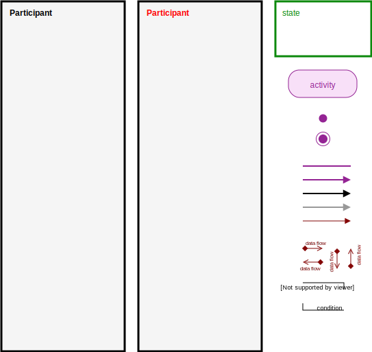

# Business and Object RelaMon Modelling (BORM) library for draw.io

Library implements `Objects Relations Diagram (ORD)`.

## Usage

### Web Application

1. Open [borm_method_lib.xml](src/borm_method_lib.xml) file
2. Open the file as "Raw" and copy the URL of this file
3. Open [draw.io](https://www.draw.io/)
4. Open library from URL
   * File -> Open Library From -> URL
5. Enjoy!

### Desktop Application

1. Download [borm_method_lib.xml](src/borm_method_lib.xml)
2. Run `draw.io` dektop application
3. Locate the file on your computer and open it as library
   * File -> Open Library...
4. Enjoy!

## Examples

You can find examples of ORD in [examples.xml](src/examples.xml)

### How to Open Examples

### Open in Web Application

1. Open [examples.xml](src/examples.xml) file
2. Open the file as "Raw" and copy the URL of this file
3. Open [draw.io](https://www.draw.io/)
4. Open file from URL
   * File -> Open From -> URL
5. Enjoy!

### Open in Desktop Application

1. Download [examples.xml](src/examples.xml)
2. Run `draw.io` dektop application
3. Locate the file on your computer and open it
   * File -> Open...
4. Enjoy!

## List of Shapes

## Author

* **Tomáš Patro** - [patrotom](https://github.com/patrotom)

Faculty of Information Technology  
Czech Technical University in Prague  
Thákurova 9, 160 00 Prague 6  
Czech Republic

## License

This project is licensed under the MIT License - see the [LICENSE](LICENSE) file for details
